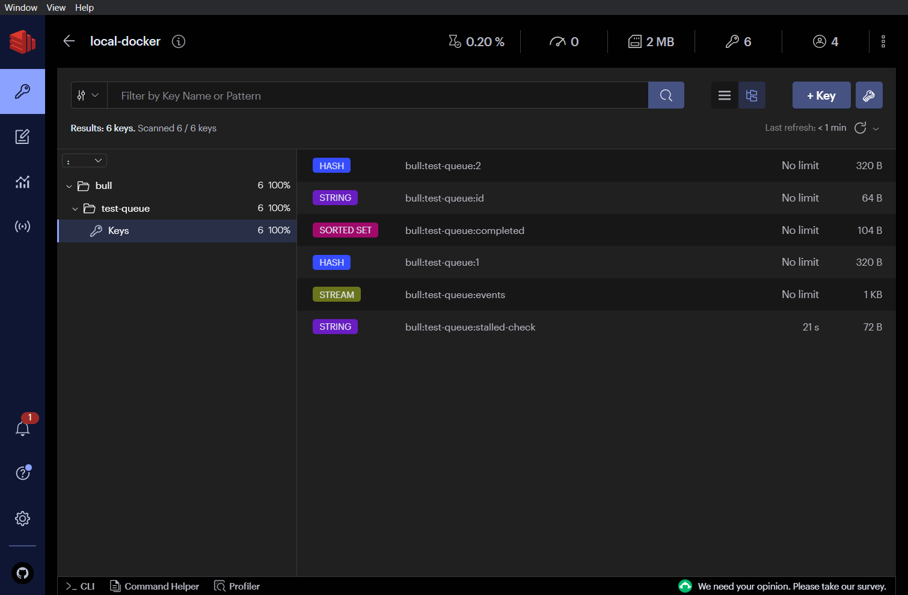
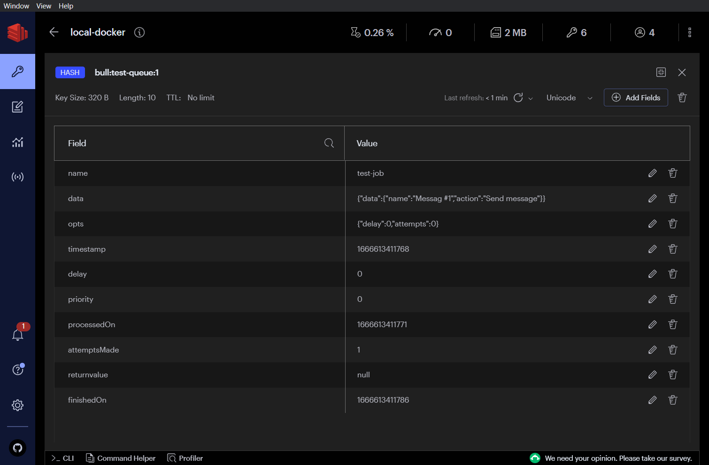
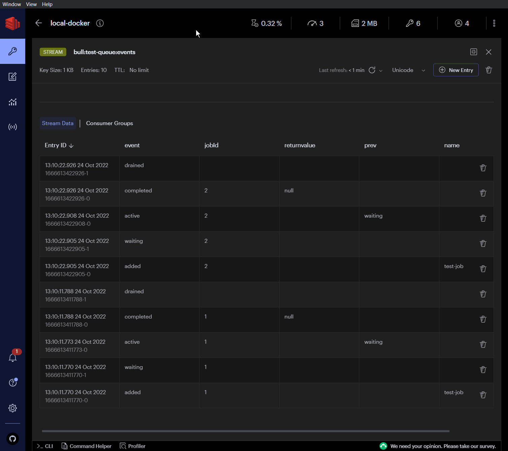

# explore-bull-mq

Brief exploration exercise on [BullMQ](https://docs.bullmq.io/).

## Description

The express application shows a page that enqueues a message that's processed by a worker.

The results are displayed with `console.log()`.

## Redis data

### Folders and keys

### Job

### Events

